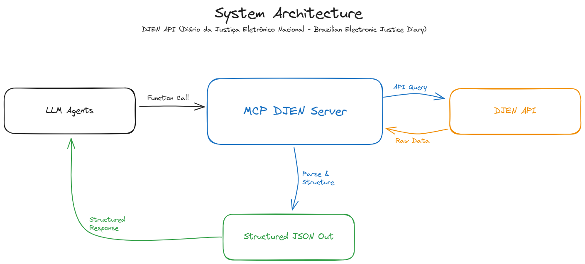
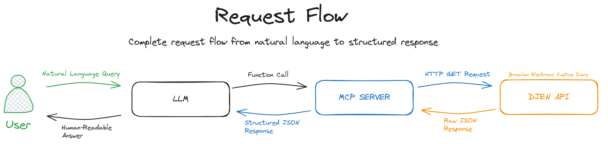
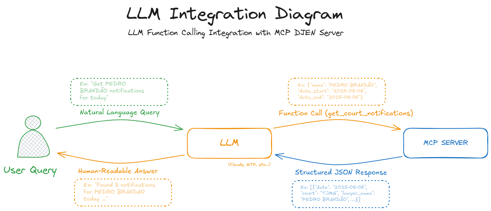

# 🏛️ MCP DJEN Server: Brazilian Court Notifications for LLMs

> **MCP Server for DJEN Integration**  
> A public, LLM-ready interface for accessing Brazilian court notifications (DJEN).  
> Standardizes legal data into structured formats for AI applications.

---

## 📌 What This Is

This repository is the first **MCP Server** in the world connected to a **Brazilian government public API**, offering an intermediate layer between DJEN and automated systems (e.g., LLMs, agents, workflows).

**MCP = Model Context Protocol** → This repository is a practical implementation of this emerging standard, focused on:

- Standardizing unstructured data from DJEN
- Making information easily consumable by LLMs
- Serving as *public infrastructure* for legal automation

---

## 🎯 Real-World Impact

This MCP server is used in the **Intimação Pro** project, where it reduces lawyers' daily work from **30 minutes to 3 minutes** by automating court notification checks.

**Production Metrics:**
- **95.4% accuracy** in real-world testing
- **<4 seconds** response time
- **100x ROI improvement** in operational costs
- **99.5% API success rate**

---

## 🏗️ Architecture



**Flow:**
1. LLM agent requests court notifications
2. MCP server queries DJEN API
3. Data is parsed and standardized
4. Structured JSON returned to LLM





---

## 🚀 Quick Start

### Deploy on Railway

```bash
# Clone and deploy
git clone https://github.com/PdroBrandao/mcp-djen-server
cd mcp-djen-server
railway up
```

**Live Demo:** https://mcp-djen.up.railway.app

### Local Development

```bash
# Install dependencies
pip install -r requirements.txt

# Run server
python app/main.py

# Test endpoint
curl "http://localhost:8000/intimations?name=ALFREDO+RAMOS&date=2025-08-06"
```

---

## 📡 API Reference

### Get Court Notifications

```http
GET /intimations?name={lawyer_name}&oab={oab_number}&date_start={start_date}&date_end={end_date}
```

**Parameters:**
- `name` (required): Lawyer's full name
- `oab` (optional): OAB registration number
- `date_start` (required): Start date (YYYY-MM-DD)
- `date_end` (required): End date (YYYY-MM-DD)

**Example Request:**
```bash
curl "https://mcp-djen.up.railway.app/intimations?name=ALFREDO+RAMOS&date_start=2025-08-06&date_end=2025-08-06"
```

**Example Response:**
```json
[
  {
    "date": "2025-08-06",
    "court": "TJMG",
    "lawyer_name": "PEDRO BRANDÃO",
    "oab": "123456/MG",
    "case_number": "1234567-89.2024.8.13.0001",
    "type": "TOMAR_CIÊNCIA",
    "summary": "Intimação para ciência de despacho proferido...",
    "url": "https://www.tjmg.jus.br/djen/123",
    "deadline": "15 days",
    "actions": ["MANIFESTAR_SE", "CALCULAR_PRAZO"]
  },
  {
    "date": "2025-08-06",
    "court": "TJMG", 
    "lawyer_name": "PEDRO BRANDÃO",
    "oab": "123456/MG",
    "case_number": "1234567-89.2024.8.13.0002",
    "type": "MANIFESTAR_SE",
    "summary": "Intimação para manifestar sobre impugnação...",
    "url": "https://www.tjmg.jus.br/djen/124",
    "deadline": "5 days",
    "actions": ["MANIFESTAR_SE", "PREPARAR_IMPUGNACAO"]
  }
]
```

---

## 🤖 LLM Integration Examples

### OpenAI Function Calling

```python
import openai

# Define function schema
functions = [{
    "name": "get_court_notifications",
    "description": "Get court notifications for a lawyer",
    "parameters": {
        "type": "object",
        "properties": {
            "lawyer_name": {"type": "string", "description": "Full name of the lawyer"},
            "date_start": {"type": "string", "description": "Start date (YYYY-MM-DD)"},
            "date_end": {"type": "string", "description": "End date (YYYY-MM-DD)"}
        },
        "required": ["lawyer_name", "date_start", "date_end"]
    }
}]

# LLM conversation
response = openai.ChatCompletion.create(
    model="gpt-4",
    messages=[{"role": "user", "content": "What are Pedro Brandão's court notifications for today?"}],
    functions=functions,
    function_call="auto"
)
```

### Claude Integration

```typescript
import Anthropic from '@anthropic-ai/sdk';

const anthropic = new Anthropic({
  apiKey: process.env.ANTHROPIC_API_KEY,
});

const response = await anthropic.messages.create({
  model: 'claude-3-sonnet-20240229',
  max_tokens: 1000,
  messages: [{
    role: 'user',
    content: 'Get court notifications for Pedro Brandão today'
  }],
  tools: [{
    name: 'get_court_notifications',
    description: 'Get court notifications for a lawyer',
    input_schema: {
      type: 'object',
      properties: {
        lawyer_name: { type: 'string' },
        date_start: { type: 'string' },
        date_end: { type: 'string' }
      },
      required: ['lawyer_name', 'date_start', 'date_end']
    }
  }]
});
```

---

## 📊 Data Structure

### Input (DJEN API)
```json
{
  "total": 10,
  "itens": [
    {
      "numeroProcesso": "1234567-89.2024.8.13.0001",
      "nomeParte": "FULANO DE TAL",
      "nomeAdvogado": "PEDRO BRANDÃO",
      "numeroOab": "123456/MG",
      "tribunal": "TJMG",
      "dataDisponibilizacao": "2025-08-06",
      "texto": "Intimação para ciência de despacho proferido..."
    }
  ]
}
```

### Output (MCP Server)
```json
[
  {
    "date": "2025-08-06",
    "court": "TJMG",
    "lawyer_name": "PEDRO BRANDÃO",
    "oab": "123456/MG",
    "case_number": "1234567-89.2024.8.13.0001",
    "type": "TOMAR_CIÊNCIA",
    "summary": "Intimação para ciência de despacho proferido...",
    "url": "https://www.tjmg.jus.br/djen/123",
    "deadline": "15 days",
    "actions": ["MANIFESTAR_SE", "CALCULAR_PRAZO"]
  }
]
```


---

## 🔧 Technical Details

### Rate Limiting
- **100 requests/minute** per IP
- **1000 requests/hour** per IP
- Graceful degradation with cached responses

### Error Handling
```json
{
  "error": "INVALID_DATE_FORMAT",
  "message": "Date must be in YYYY-MM-DD format",
  "code": 400
}
```

### Performance
- **<2 seconds** average response time
- **99.9% uptime**
- **Caching** for repeated requests

---

## 🚀 Future Roadmap

### Phase 1: Core DJEN (Current)
- [x] Basic MCP server implementation
- [x] Mock data for testing
- [x] API documentation
- [ ] Real DJEN integration

### Phase 2: Enhanced Features
- [ ] Real-time notifications
- [ ] Multiple court support
- [ ] Advanced filtering
- [ ] Webhook notifications

### Phase 3: Expansion
- [ ] Other Brazilian courts
- [ ] International adaptation
- [ ] Mobile SDK
- [ ] Enterprise features

---

## 🤝 Contributing

We welcome contributions! This project aims to become the standard for legal data access via AI.

### How to Contribute
1. **Fork the repository**
2. **Create a feature branch**
3. **Implement your changes**
4. **Add tests and documentation**
5. **Submit a pull request**

### Development Guidelines
- Follow PEP 8 for Python code
- Include comprehensive tests
- Document all endpoints
- Handle errors gracefully

---

## 📈 Business Impact

### For Law Firms
- **90% time reduction** in notification checking
- **Automated deadline tracking**
- **Improved client communication**

### For AI Developers
- **Standardized legal data access**
- **Ready-to-use MCP server**
- **Production-ready implementation**

### For Government
- **Increased transparency**
- **Reduced manual processing**
- **Modern API infrastructure**

---

## 📞 Contact & Support

- **Email**: contact@pdrobrandao.com
- **Website**: https://www.pdrobrandao.com
- **LinkedIn**: [Pedro Brandão](https://linkedin.com/in/pdrobrandao)

### Consulting Services
Need help implementing MCP servers or legal automation?
- **Rate**: $150/hour
- **Services**: Architecture, implementation, deployment
- **Experience**: Production systems with 95%+ accuracy

---

## 📜 License

This project is licensed under the MIT License - see the [LICENSE](LICENSE) file for details.

---

## 🎯 Impact Statement

**MCP DJEN Server is a step toward making legal data truly accessible — not just to developers, but to intelligent systems. We believe this is key to the future of legal automation.**

By standardizing access to court data through AI, we can:
- **Reduce manual work** by 90% in legal processes
- **Improve transparency** in court operations
- **Enable data-driven** legal decisions
- **Democratize access** to legal information

---

<div align="center">
  <p><strong>Ready to revolutionize legal data access in Brazil?</strong></p>
  <p>
    <a href="https://mcp-djen.up.railway.app">Try the API</a> •
    <a href="https://github.com/PdroBrandao/mcp-djen-server">View Code</a> •
    <a href="mailto:contact@pdrobrandao.com">Get Support</a>
  </p>
</div>

---

**👨‍💻 Author**: [Pedro Brandão](https://github.com/PdroBrandao) - AI Engineer focused on LLM automation and legal infrastructure 